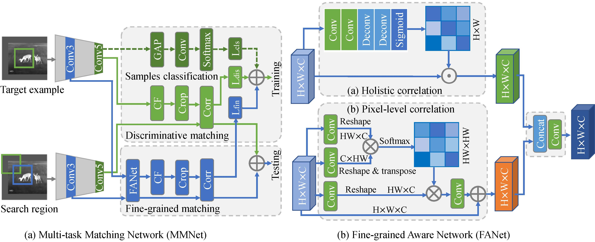

## Multi-Task Driven Feature Models for Thermal Infrared Tracking (AAAI2020)
## Abstract
We propose a feature model comprising TIR-specific discriminative features and fine-grained correlation features for TIR object representation. Then, we develop a multi-task matching framework (MMNet) to integrate these two features for robust TIR tracking. In addition, we build a large-scale TIR training dataset to train the network for adapting the model to the TIR domain. More details please see our [paper](https://www.researchgate.net/publication/337533102_Multi-Task_Driven_Feature_Models_for_Thermal_Infrared_Tracking), [supplementary material](https://www.researchgate.net/publication/337757412_1836Supplementary-materialpdf).

## Download
*  You can download the proposed TIR training dataset from [Baidu Pan](https://pan.baidu.com/s/1uLQ8pHsAbBq8hRFM2aOhYg). [News 2020-08] We have extended this dataset to a new TIR object tracking benchmark, [LSOTB-TIR](https://github.com/QiaoLiuHit/LSOTB-TIR). 
*  You can download several our trained models from [Baidu Pan](https://pan.baidu.com/s/1czaAeie5iD8hvXjJV401Pw) or [MEGA drive](https://mega.nz/#!UxAR2KIa!3DzmnShyGXwV5OkAz2mv1jRYbJZMEtanQRerHV8SGFk).
*  You can download the tracking raw results of three benchmarks from [Baidu Pan](https://pan.baidu.com/s/1knmuUTv72cLwhy40eUOMlA) or [MEGA drive](https://mega.nz/#!o5BXzQ5Y!z0hl0N91AFKDLgCbCJ-MWwlVGyXMdvOY97dkyj-aRlQ).
*  We provide a raw result of MMNet on the LSOTB-TIR Benchmark in [here](https://pan.baidu.com/s/1D88Rg-NspfzHRg4nE8C7Lw?pwd=o9ll).
## Usage
### Tracking
1. Clone the code and unzip it in your computer.
2. Prerequisites: Ubuntu 14, Matlab R2017a, GTX1080, CUDA8.0.
3. Download our trained models from [here]() and put them into the `src/tracking/networks` folder .
4. Run the `run_demo.m` in `src/tracking` folder to test a TIR sequence using a default model.
5. Test other TIR sequences, please download the PTB-TIR dataset from [here](https://github.com/QiaoLiuHit/PTB-TIR_Evaluation_toolkit).
### Training
1. Preparing your training data like that in [here](https://github.com/bertinetto/siamese-fc/tree/master/ILSVRC15-curation). Noting that preparing the TIR training data uses the same format and method as the above.
2. Configure the path of training data in  `src/training/env_path_training.m`.
3. Run `src/training/run_experiment_MMNet.m`. to train the proposed MMNet.
4. The network architecture and trained models are saved in `src/training/data-MMNet` folder.
## Citation
If you use the code or dataset, please consider citing our paper.
```
@inproceedings{MMNet,
  title={Multi-Task Driven Feature Models for Thermal Infrared Tracking},
  author={Liu, Qiao and Li, Xin and He, Zhenyu and Fan, Nana and Yuan, Di and Liu, Wei and Liang, YongSheng},
  booktitle={Thirty-Fourth AAAI Conference on Artificial Intelligence},
  pages={11604-11611},
  year={2020}
}
or
The extened journal version
@article{MMNet,
  title={Learning Dual-Level Deep Representation for Thermal Infrared Tracking},
  author={Liu, Qiao and Yuan, Di and Fan, Nana and Gao, Peng and Li, Xin and He, Zhenyu},
  journal={IEEE Transactions on Multimedia},
  year={2022}
}
```
## Contact
Feedbacks and comments are welcome! 
Feel free to contact us via liuqiao.hit@gmail.com or liuqiao@stu.hit.edu.cn
